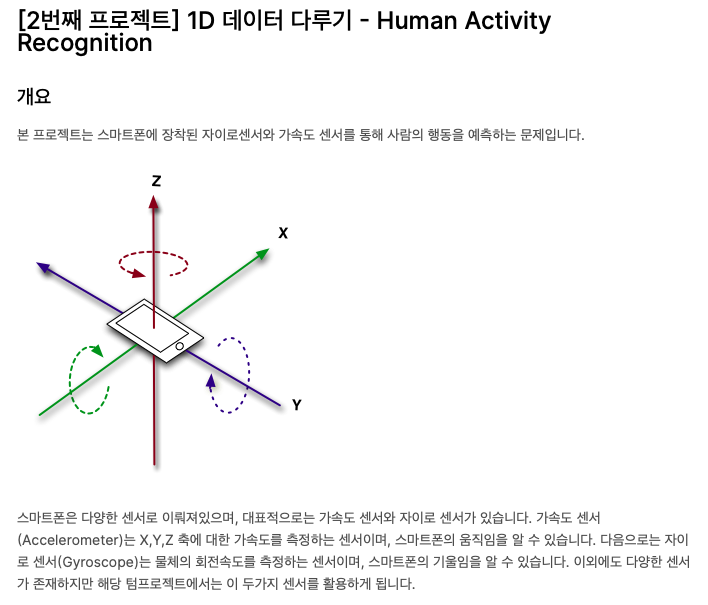
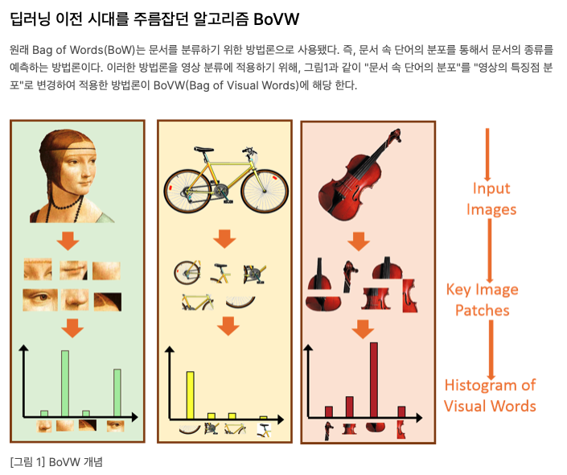
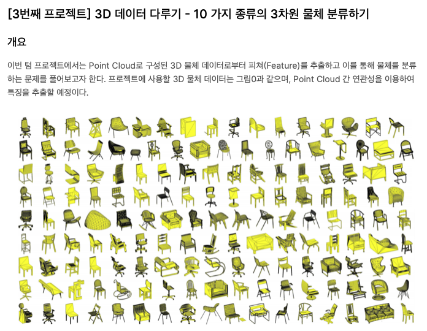

# Machine_Learning

|||||||
|:--:|:--:|:--:|:--:|:--:|:--:|
|[Regression:](https://github.com/minnnnji/Machine_Learning/tree/master/Regression) | KNN | Decision Tree| Logistic Regression|ensemble|
|[Classifiation:](https://github.com/minnnnji/Machine_Learning/tree/master/Classification) |KNN|LDA & QDA|Logistic Regression|Decision Tree|ensemble
|handcrafted feature - 1D| [code ](https://github.com/minnnnji/Machine_Learning/blob/master/handcrafted%20feature/자이로%2B%20가속도%201D%20Data%20결과%20%2B%20코드/1D_data.ipynb)| [ kaggle ](https://www.kaggle.com/c/2020mltermprojecthar)| 
|handcrafted feature - 2D| [code ](https://github.com/minnnnji/Machine_Learning/blob/master/handcrafted%20feature/Bovw_2D%20Data%20결과%20%2B%20코드/BovW_5.ipynb)| [ kaggle ](https://www.kaggle.com/c/2020mltermprojectbovw)|
|handcrafted feature - 3D| [code ](https://github.com/minnnnji/Machine_Learning/blob/master/handcrafted%20feature/Point_cloud%203D%20Data%20결과%20%2B%20코드/3d%20data.ipynb)| [ kaggle ](https://www.kaggle.com/c/2020mltermproject3dclassification)|

---

#### 세종대학교 SW - AI 융합챌린지 ( 인공지능 챌린지 ) 은상 수상  - [[ kaggle ]](https://www.kaggle.com/c/sejong-ai-challenge-p3)
